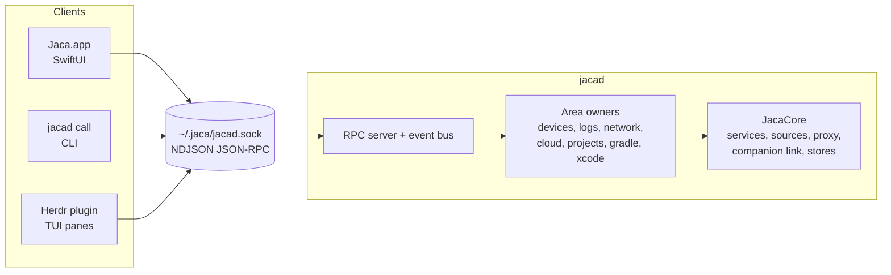

# Jaca daemon: experimental plan

Move Jaca's business logic into a long-running background process (`jacad`) so more than one
front end can drive it. The SwiftUI app becomes one client. A Herdr plugin, rendering Jaca's
areas as terminal panes, becomes a second one.

Status: experimental, in progress on branch `exp/daemon`. Nothing merges to `main` until an
area works end to end through the daemon. Last updated: 2026-09-27.

## Progress

| Phase | State |
|---|---|
| 0. Core compiles on its own | Done, with a different approach (see "Changes from the first draft"). |
| 1. Protocol and daemon skeleton | Done. |
| 2. Gradle, Xcode, Projects | Done. |
| 3. Herdr plugin prototype | Done (Gradle pane + two actions). Not linked into Herdr yet. |
| 4. Devices | Done. |
| 5. Log streaming | Done. Physical iOS untested (no device here); the private frameworks load in `jacad`. |
| 6. Cloud logging | Done. Tested with a scripted poller, not against GCP. |
| 7. Network capture | Done for the in-process agent. Companion capture stays in the app (see below). |
| 7b. Response overrides | Done on branch `exp/daemon-overrides` (see below). |
| 8. Herdr plugin, full | Partly done: `devices` (with log streaming), `gradle` and `projects` panes, two actions. No cloud or network panes yet. |

### Trying it

Daemon mode is per area and off by default:

```bash
defaults write dev.srsouza.Jaca daemonAreas -array gradle xcode projects devices
# or for one run:
JACA_DAEMON_AREAS=all ./path/to/Jaca.app/Contents/MacOS/Jaca
```

`JACA_DAEMON_DIR` moves the socket, lock and log (default `~/.jaca`), which keeps a development
build away from the real daemon. `Jaca.app/Contents/MacOS/jacad` is also the CLI:
`jacad describe`, `jacad call gradle.list`, `jacad watch projects.state`, `jacad status`, `jacad stop`.

### Changes from the first draft

- **No `JacaCore` framework.** A framework would need `public` on everything the app uses. The
  `jacad` tool target compiles `Sources/Core` directly instead, and the app keeps compiling all of
  `Sources/`. The tool target builds Core without Model and Features, so a Core → Model
  dependency fails the build, which was the point of phase 0. The one existing dependency
  (`DeviceContext`) moved into `Core/Devices/`. The Objective-C bridge works unchanged: a tool
  target can use the bridging header.
- **`@MainActor` is not a blocker.** `jacad` runs the main run loop, so the main actor exists
  there as in the app. Engines stay `@MainActor`.
- **Binary location:** `Jaca.app/Contents/MacOS/jacad`, next to the app executable, so
  `DaemonLauncher.bundledExecutable` resolves the same way from the app, the tests and `jacad`.
- **Settings:** no `config.json`. `JacaDefaults.shared` is the app's `UserDefaults` domain
  from either process (`.standard` in the app, `UserDefaults(suiteName: "dev.srsouza.Jaca")` in
  `jacad`), synchronized by `cfprefsd`. No import step and no second copy.
- **Engines.** Where an area model held domain logic, it moved into a Core engine
  (`ProjectsEngine`, `DevicesEngine`) with no view state. The app's model runs the engine
  in-process, or mirrors the daemon's engine through a retained topic. One implementation serves
  both modes; the model keeps view state (selection, toasts, approval prompts).
- **Schema:** `api.describe` returns every method and topic with a one-line summary instead of
  a hand-written JSON Schema file.
- **No new user-facing strings.** Daemon mode is switched with `defaults`/an environment
  variable, not a Settings toggle, and an unreachable daemon falls back to in-process work instead
  of showing an error state. Both need copy from a ticket before they get UI.
- **Herdr TUI: Go, standard library only.** Rust isn't installed here; Go is. `stty` and ANSI
  escapes cover a prototype without fetching modules.
- **Request ordering.** Requests on one connection run one at a time, in arrival order, so a
  client can pipeline "open" then "select". Slow read-only methods (`du` listings, gcloud calls,
  SQL, body and range fetches) are registered `concurrent: true` and run alongside.
- **Sessions outlive the app.** Log, cloud and network sessions in the daemon are keyed by the
  tab's id, which is now persisted in `TabDescriptor.sessionID`. A relaunched app reattaches and
  backfills from the daemon's replay buffer (100k lines / entries) without restarting the stream
  or re-querying gcloud. A session no client has watched for 10 minutes is closed
  (`JACAD_LOG_ORPHAN_SECONDS`). While a session runs, the daemon doesn't idle out.
- **Log filtering stays in the client.** The daemon owns the stream (source, reconnects, markers,
  PID tracking, body prettifying, crash markers, history). Level, text, regex, system-log and
  exclusion filters are the viewer's, since the app tab and a Herdr pane can filter differently.
  One behavior change: crash markers are injected for crashes of the targeted app regardless of
  the tab's text filter (before, a crash hidden by the filter got no marker).
- **Network bodies stay in the daemon.** Transactions stream without bodies; `network.body`
  fetches them when a row is opened, and HAR export runs in the daemon.
- **Companion capture stays in the app.** With HTTPS decryption on (an experimental opt-in) or a
  companion-only device, network tabs capture in-process. Moving `CompanionRegistry` means moving
  the gRPC links, mDNS discovery, the CA and onboarding, and nothing here could test it: no phone,
  and the Local Network permission question for a spawned helper is still open. `jacad` never
  loads the MITM CA (`CaptureContext.ca` is optional), so it can't trigger the Keychain migration
  prompt or mint a CA that devices don't trust.
- **Resources:** `JacaBundle.app` resolves `Jaca.app` from `jacad` too, so the bundled agents
  and APK are found. `jacad call daemon.diagnostics` reports what the daemon can reach.

### Measured

- Emulator logcat backlog through the daemon to a Python client: ~33k lines/s, 204k lines in
  6.2s, no dropped batches.
- App + daemon with one emulator log tab after the backlog: app ~450 MB RSS, `jacad` ~350 MB
  (both hold the lines: the app's 500k ring and the daemon's 100k replay).
- iOS Simulator agent capture of Safari driven from `jacad`: transactions streamed, a body
  fetched on demand.

### Pre-existing issues found on the way (not changed here)

- `AndroidDeviceProvider.queryAVDName` splits on `"\n"`, but `adb` prints `\r\n`, which Swift
  treats as one character: emulator models show as `"Name\r\nOK"`.
- `LogSession.connect()` sets the "App isn't installed" warning, then `start()` clears it at once,
  so the warning never shows. Kept as is in `LogStreamEngine`.
- `IOSDeviceProvider` lists simulators `devicectl` reports as "simulated" as iOS devices.
- `consumeLoop` is main-actor isolated, so every log line is iterated on the main thread; its
  `await state.isRunning` calls suggest it was meant to run off-main. Kept as is.

## Goals

- One process owns devices, log streams, network capture, cloud logging, and the maintenance
  areas. Every front end reads the same state.
- A documented, language-neutral wire protocol, so a client written in Rust or Go (a Herdr
  plugin) is as capable as the Swift app.
- The SwiftUI app keeps working throughout. Each area moves to the daemon on its own, behind a
  switch, with the in-process path kept until the daemon path is proven.

## Non-goals

- Porting the SwiftUI views. The Herdr plugin is a new TUI, written from scratch.
- Remote or multi-user access. The socket is local and owned by the user.
- Changing the companion wire protocol (`proto/companion.proto`). The daemon takes over the
  desktop side of it unchanged.

## Where the code stands

Measured on `main` at `0e5d0ba`.

| Layer | Lines | Notes |
|---|---|---|
| `Sources/Core/` | 10,677 | No SwiftUI. Services, sources, parsers, proxy, gRPC link. |
| `Sources/Model/` | 4,468 | All `@MainActor @Observable`. Mixes orchestration with view state. |
| `Sources/Features/` | 10,140 | SwiftUI views. Mostly render Core value types. |

What already fits a daemon:

- Core has no references to `AppModel`, `LogSession` or `NetworkSession` outside comments.
- Backends sit behind small protocols: `LogSource` (returns `AsyncStream<LogLine>`),
  `DeviceProvider`, `CaptureSource`.
- `HistoryStore`, `CloudLogDatabase`, `NetworkBodyCache` and `GcloudDebugLog` are actors.
- The MITM CA key is a 0600 file under `~/Library/Application Support/Jaca/ca/`, not a
  Keychain item (`CertificateAuthority.swift:26`), so a second signed binary can read it
  without the code-signature ACL prompt.

What has to change:

1. **One module.** The `Jaca` target in `project.yml` globs all of `Sources/`. A daemon needs
   Core as its own target that both binaries link.
2. **One compile-time Core → Model dependency.** `CaptureContext` and `CaptureSourceDescriptor`
   take a `DeviceContext`, which lives in `Sources/Model/DeviceContext.swift`
   (`CaptureSource.swift:10,48`, `CaptureSourceRegistry.swift:48,57`).
3. **Main-actor types inside Core.** `CaptureContext`, `CaptureSink`, `CaptureSource`,
   `CaptureSourceDescriptor` (`Core/Capture/CaptureSource.swift`) and `CompanionHub`
   (`Core/Companion/CompanionHub.swift:8`).
4. **No wire format.** `LogLine` and `NetworkTransaction` are `Sendable` but not `Codable`.
   Events flow through closures (`CaptureSink`, `onChange`) and `AsyncStream`s.
5. **Orchestration in `Model/`.** `LogSession` holds the line buffer, exclusions, crash
   tracking and history persistence next to `displayMap`, `scrollTarget`, `followTail` and
   `collapsedBodies`. `NetworkSession`, `CloudLogSession` and `ProjectsModel` have the same mix.
6. **Settings in the app's `UserDefaults` domain.** `httpsDecryptionEnabled`,
   `logExclusions`, `logPrettifyJSONBodies`, `retentionDays`, `adbPath`, `openTabs`,
   `jaca.projectFolders`, `jaca.herdr.claudeCommand`, and others. A daemon with its own bundle
   id reads a different domain.
7. **AppKit in Core.** `Core/Companion/QRCode.swift` returns an `NSImage`.
8. **Objective-C bridge on the app target.** `JacaOSLog.{h,m}` (LoggingSupport private API)
   is exposed through `Sources/Jaca-Bridging-Header.h`. Framework targets can't use a bridging
   header.

## Target architecture



- **`JacaCore`**: a framework target built from `Sources/Core/`. Linked by the app, the daemon
  and the tests.
- **`jacad`**: a command-line target. `jacad serve` runs the daemon. `jacad call <method>
  [json]` sends one request and prints the response, which is what Herdr plugin actions will
  invoke.
- **Area owners** in the daemon: plain actors, not `@Observable`. They hold what `Model/`
  holds today minus view state, and publish changes as events.
- **The app**: `Model/` keeps its `@Observable @MainActor` types. For a migrated area the model
  reads from a daemon client instead of calling Core. Views don't change.

## Decisions

**Transport: a Unix domain socket with newline-delimited JSON-RPC 2.0.** Herdr uses the same
shape (`~/.config/herdr/herdr.sock`, JSON envelopes), `HerdrService.swift` already drives it,
and plugin actions are argv commands, so a client that works from a shell with `jq` matters.
XPC was ruled out because non-Swift clients can't speak it. gRPC over the socket was the other
candidate: the repo already has grpc-swift and protobuf, and HTTP/2 flow control handles log
backpressure. It was set aside because it can't be called from a shell script. Revisit if log
streaming can't keep up in phase 5.

**Socket path: `~/.jaca/jacad.sock`.** `~/.jaca` already holds Jaca state, and macOS limits
`sun_path` to 104 bytes, which rules out long Application Support paths. Mode 0600.

**Framing and messages.**

- Request: `{"jsonrpc":"2.0","id":1,"method":"gradle.list","params":{}}`
- Response: `{"jsonrpc":"2.0","id":1,"result":{...}}` or `{"jsonrpc":"2.0","id":1,"error":{"code":...,"message":"..."}}`
- Event, pushed on a connection that called `events.subscribe`:
  `{"jsonrpc":"2.0","method":"event","params":{"topic":"devices.changed","data":{...}}}`
- Method names are `<area>.<verb>`, matching Herdr's style.
- The first call on every connection is `hello` with the client's protocol version. The daemon
  answers with its own version and build commit. On a mismatch the app restarts the daemon;
  other clients show the mismatch and stop.

**Lifecycle: spawned on demand for the experiment.** A client that can't connect starts
`jacad serve` detached and retries for a few seconds. The daemon exits after a configurable
idle period with no clients and no running capture or log session. Registering it as a login
item through `SMAppService` is deferred: ad-hoc signatures change on every build and would
break the registration.

**The daemon is the only writer** of every persisted file (`~/.jaca/…`,
`~/Library/Caches/Jaca/…`, the history database, the CA). The app stops writing any of them
for an area once that area is migrated.

**Settings move to a daemon-owned config file** (`~/.jaca/config.json`), readable and writable
through `config.get` / `config.set` and announced through a `config.changed` event. On first
start the daemon imports the existing values from the app's `UserDefaults` domain
(`dev.srsouza.Jaca`) once. The file follows the migration rules in `CLAUDE.md`: tolerant
`init(from:)`, `CloudPersistence.decodeArray` for arrays, and a test that decodes an old-schema
file.

**Failure handling.** Nothing in the daemon may crash on client input. A malformed request, an
unknown method, a missing field or an unknown id gets an error response and the connection
stays open. A service failure becomes an error response or an event with an error state. On the
client side, a missing or dead daemon puts the area in a visible "daemon unavailable" state
with a retry control, and the app falls back to the in-process path while that path still
exists.

**Wire types.** Every type that crosses the socket gets `Codable` with the same tolerant decode
as persisted models, so a newer daemon and an older client (or the reverse) degrade instead of
failing. Golden JSON fixtures under `Tests/Fixtures/jacad/` pin the encoding. The protocol is
described in a hand-written JSON Schema at `proto/jacad.schema.json`, and a test checks every
fixture against it. `jacad call api.schema` prints it, like `herdr api schema`.

## Phases

Each phase ends with something runnable. Estimates are rough working days.

### Phase 0: split Core into `JacaCore` (2–3 days)

Useful on its own: it enforces the layer rule at compile time.

- Add a `JacaCore` framework target in `project.yml` sourcing `Sources/Core/`. Point `Jaca`
  at `Sources/App`, `Sources/Model` and `Sources/Features`, and add the dependency.
- Move `DeviceContext`'s capability data into a Core value type (for example
  `DeviceCapabilities`) that `CaptureContext` and the registry take. `DeviceContext` in
  `Model/` keeps the polling and holds that value.
- Change `QRCode.image` to return PNG `Data`. The view makes the `NSImage`.
- Replace the bridging header with a module map for `JacaOSLog.h` inside `JacaCore`. Check it
  against the `investigate-loggingsupport` skill: physical-device logs must still stream.
- Add `public` where the app uses Core API. Expect this to be the bulk of the diff.

Done when: the app builds and behaves as before, `JacaTests` pass (skipping the live suites),
and `Sources/Core` fails to compile if it imports a Model type.

### Phase 1: protocol and daemon skeleton (2–3 days)

- `jacad` command-line target linking `JacaCore`, built into
  `Jaca.app/Contents/Helpers/jacad`.
- Socket server on SwiftNIO (already a dependency): NDJSON framing, JSON-RPC dispatch, per
  connection subscriptions, `hello`, `ping`, `api.schema`, `events.subscribe`.
- Idle shutdown and the stale-socket check (a leftover socket file with nothing listening is
  removed, then bound).
- `jacad call` for one-shot requests.
- A small Swift client in the app (`Model/Daemon/DaemonClient.swift`): connect or spawn,
  handshake, request/response by id, an `AsyncStream` per event topic, and reconnect.
- The config file and the one-time `UserDefaults` import.
- A setting to turn daemon mode on per area, off by default.

Done when: `jacad call ping` works from a shell, and the codec and config migration tests pass.

### Phase 2: stateless areas (2–3 days)

Gradle daemons, Xcode DerivedData, and Projects. Their services already do the work off the
main actor and their models are mostly caches.

- Daemon owners wrap `GradleDaemonService`, `DerivedDataService`, `ProjectsScanner`,
  `ProjectsCache`, `GitService`, `CacheCleaner` and `FolderWatcher`.
- Methods: `gradle.list`, `gradle.kill`, `gradle.clearCache`, `xcode.list`, `xcode.delete`,
  `projects.list`, `projects.refresh`, `projects.addFolder` (takes a path; the open panel stays
  in the app), `projects.clearCache`, `projects.deleteWorktree`.
- Events: `gradle.changed`, `xcode.changed`, `projects.changed`, and per-row size patches as
  `du` results land.
- The cache-first behavior from `CLAUDE.md` moves into the daemon. The app still renders the
  last result immediately: it caches the last `*.list` response locally, read-only.
- Stays in the app: `NSOpenPanel`, open in Finder, Zed and Herdr, sheets, and the Update area
  (it rebuilds the app, so it belongs to the app).

Done when: all three areas work in daemon mode with the same behavior, and killing `jacad`
mid-refresh shows the unavailable state and recovers on retry.

### Phase 3: Herdr plugin prototype (2–3 days)

Done this early to test the protocol against a non-Swift client before the hard phases.

- Plugin directory `herdr-plugin/` with a manifest: a `startup` command that runs
  `jacad call ping` (which spawns the daemon), and one pane `jaca-gradle` with
  `placement: "tab"`.
- A TUI binary that subscribes to `gradle.changed`, renders the daemon table, and kills a
  daemon on a keypress.
- Actions: `jaca.gradle.killAll` (`contexts: ["global"]`) and `jaca.projects.clearCache`
  (`contexts: ["workspace"]`), which reads `worktree.checkout_path` from the invocation context.
- Link it with `herdr plugin link herdr-plugin`.

Open: the TUI language. Rust with ratatui matches Herdr. Go with Bubble Tea is quicker to
write. Pick one here and keep it.

Done when: the Gradle pane in Herdr and the Gradle area in the app show the same daemons, and
killing one from either side updates both.

### Phase 4: devices (2 days)

- Move `AndroidDeviceProvider`, `SimulatorDeviceProvider`, `IOSDeviceProvider` and the merge
  logic from `AppModel` into a daemon `DevicesOwner`. Per-device capability and installed-app
  polling (today in `DeviceContext`) moves with it.
- Methods: `devices.list`, `devices.apps`. Event: `devices.changed`.
- `Device` is already `Codable`. Add the tolerant decode.
- Companion devices join in phase 7. Until then the app merges them in as today.

Done when: the sidebar device list comes from the daemon and adb connect and disconnect show up
live.

### Phase 5: log streaming (4–6 days)

The largest `Model/` split and the one most likely to regress.

- Daemon `LogSessionOwner` per session: owns the `LogSource` (and the console source), the
  line buffer, `LogFilter`, exclusions, `CrashDetector`, the app-alive tracking, and history
  persistence through `HistoryStore`.
- Methods: `logs.open` (device, bundle id, filter; returns a session id), `logs.close`,
  `logs.setFilter`, `logs.range` (lines by seq for scrollback), `logs.search`.
- Event: `logs.lines` with a batch of lines, sent on the same timer-flush cadence the app uses
  today. When a client falls behind, the daemon drops whole batches for that client, counts
  them, and reports the count in the next batch. The app already has `droppedCount` to show it.
- `LogLine` gets `Codable` with tolerant decode, plus golden fixtures including multi-line
  bodies and JSON bodies.
- Stays in the app: `displayMap`, `scrollTarget`, `followTail`, `collapsedBodies`, `listEpoch`,
  body prettifying for display, copy formats.
- Measure with a chatty emulator before and after: CPU in both processes, and end-to-end
  latency from the logcat line to the rendered row.

Done when: logcat, simulator and physical-device streams match in-process mode, the UI does not
stutter under a chatty device, and restarting the app reattaches to a still-running session.

### Phase 6: cloud logging (3–4 days)

- Daemon owners for `CloudLoggingRegistry` (gcloud detection and auth, projects, log names,
  labels) and each `CloudLogSession` (the `CloudLogPoller`, `CloudLogDatabase`, the query).
- `CloudRegexAssistant`, `CloudSqlAssistant` and `ClaudeCodeCLI` stay callable from the app. The
  views that call them directly today go through their model instead.
- The persisted stores (`CloudProjectStore`, `CloudTemplateStore`) move with the daemon as
  their only writer. The existing `CloudMigrationTests` must keep passing.

Done when: cloud log tabs work in daemon mode and survive an app relaunch without re-querying.

### Phase 7: network capture and the companion (6–8 days)

- Remove `@MainActor` from `CaptureContext`, `CaptureSink`, `CaptureSource`,
  `CaptureSourceDescriptor` and `CompanionHub`. Replace with an actor or explicit queues.
  Every capture source changes: proxy, Android agent, iOS Simulator agent, companion.
- Move `CompanionRegistry`, `CompanionSetupModel`'s transport side, `ProxyServer`,
  `CertificateAuthority` and `NetworkBodyCache` into the daemon.
- Methods: `network.open`, `network.close`, `network.sources` (the capture options for a
  device), `network.start`, `network.body` (lazy, like `ensureBodies` today),
  `network.exportHAR`, `companion.list`, `companion.pushCA`, `companion.onboarding` (the QR
  payload and PNG).
- Events: `network.transactions` (batched, bodies omitted), `network.status`, `companion.changed`.
- `NetworkTransaction` gets `Codable` and fixtures.
- Local network permission: the app declares `NSLocalNetworkUsageDescription` and
  `NSBonjourServices`. Check which process macOS attributes the daemon's mDNS browse to when
  the app spawns it. If the daemon needs its own grant, it needs an embedded Info.plist with
  both keys, and the build step that injects `NSBonjourServices` has to cover it too.

Done when: proxy, agent and companion capture all work in daemon mode, the CA isn't
regenerated, and HAR export matches in-process output.

### Phase 8: Herdr plugin, full (open-ended)

Add panes as the daemon side lands: `jaca-devices`, `jaca-logs` (per device, `split`
placement), `jaca-cloud-logs`, `jaca-projects`, `jaca-network`. Use `pane.graphics.set` for the
companion QR code. Add a `link_handlers` entry so URLs in agent output can open a matching
cloud-log or network view.

## Rough total

Phases 0 to 7: about 5 to 6 weeks of focused work. Phases 5 and 7 carry most of the risk.
Phase 8 depends on how far the TUI goes.

## Risks

- **Two processes to keep in sync.** The in-app updater rebuilds the app. It must also stop the
  old daemon, or the `hello` version check has to catch the mismatch. Test that path in
  phase 1.
- **Private API from a helper.** LoggingSupport and MobileDevice are loaded with `dlopen`. They
  should load the same way from a command-line tool, but verify in phase 0 before building on
  it.
- **UI tests.** `JACA_UITEST` and `JACA_AUTO_SESSION` configure `AppModel`. In daemon mode
  they need a daemon started with an isolated config directory, or they keep running
  in-process.
- **Flaky suites.** `AppModelIntegrationTests` and the live suites are already unstable.
  Compare against a baseline run before blaming a phase.
- **Scope creep in phase 0.** Adding `public` touches many files. Keep it mechanical and
  don't refactor in the same change.

## Open questions

- TUI language for the Herdr plugin (phase 3).
- Whether the in-process path is deleted after an area is proven, or kept as a no-daemon mode.
  Keeping it doubles the surface to test.
- Whether `jacad` should also run outside the app bundle (installed with Homebrew next to
  `herdr`) for users who only want the plugin.

## Response overrides in the daemon (branch `exp/daemon-overrides`)

`exp/daemon-overrides` is `exp/daemon` plus the response-override feature from
`feat/override-http-ios` (commits `5560fec`, `41e35b1`, `3362a79`; the branch's last commit,
`ffd8f0a`, is a temporary wip holding commit and was left out).

**Where it runs.** Overrides are armed by the capture source, so the runtime lives with the
capture. `OverridesEngine` (Core) holds the rule library, master switch, hit counts, per-target
arming state, the resolver, and the divert coordinators. The app's `OverridesModel` keeps its API:
with the `network` area off it runs the engine in-process; with it on, `jacad` runs the engine
(`OverridesArea`, retained `overrides.state`), daemon captures get its `services()`, and the model
mirrors the state and compiles the mirrored rules locally for the editor's match previews and
"can't run here" hints. Rule edits go through `overrides.save/remove/setEnabled/duplicate/move/
setMaster`, in order.

**Capture state.** `NetworkCaptureState` gained what the toolbar and attach banner read from the
running source: `attachState`, `interceptWired`, `interceptCapabilities`, `hasRunningSource`.
`network.restartForInterceptChange` and `network.relaunchToAttach` reach the daemon's source.

**Settings.** The three new flags (`responseOverridesEnabled`, `networkOverridesMasterEnabled`,
`simulatorAutoReattachEnabled`) read `JacaDefaults.shared`, so `jacad` sees the app's values.

**Tunnels.** `jacad` reconciles tunnels left by a dead process when it starts and reverts its own
(`AdbTunnelCleanup`, `ProxyCleanup`) when it stops. The ledger is keyed by pid, so the app's and
the daemon's reconciliation leave each other's live tunnels alone.

**Verified.** A rule saved through `jacad` answered Safari's `bag.itunes.apple.com` requests on the
iOS Simulator with 418 while the agent capture ran in the daemon: the transactions carry the rule
id, the hit count and `active` arming (with the rule's host) reached `overrides.state`.

**One switch.** Where network capture runs is decided by the HTTPS decryption setting alone
(`DaemonConnector.networkRunsInDaemon`): on, everything network (companion and agent capture, the
override engine) runs in the app, since decryption needs the companion links and the CA there; off,
agent capture and overrides run in `jacad` when the `network` area is enabled. So there is always
exactly one override engine and one writer of `rules.json`. Flipping the setting moves the override
runtime (`OverridesModel.setRuntime`; the daemon re-reads the library with `overrides.reload` when it
takes over) and replaces every open network tab on the wrong side with one on the right side, in
place, with its source restored but stopped (restarting could relaunch the user's app).

**Limits.** Android divert through the daemon is untested here (no agent build). The tab migration
on toggle has no automated test (it needs a full `AppModel`).

**Merge notes.**
- `3362a79` accidentally reverted #50 (`ProjectsModel.swift`, `DirectorySizer.swift`,
  `ProjectsAreaView.swift`, and deleted `DirectorySizerTests.swift`); its files match the pre-#50
  versions exactly, and the wip commit restores them. The merge keeps #50.
- `OverrideRuleStore.collectGarbage` deleted any unreferenced blob, including one written for a
  seeded rule still open in the editor, whenever another rule was saved. It now keeps blobs younger
  than 24 hours. This affected the in-process app too.
- `JACA_OVERRIDES_DIR` moves the rule library; the new daemon tests use it. The branch's existing
  `OverrideAuthoringTests` still save into the real `~/.jaca/network-overrides`.
- `jacad stop` now returns once the daemon has exited.
